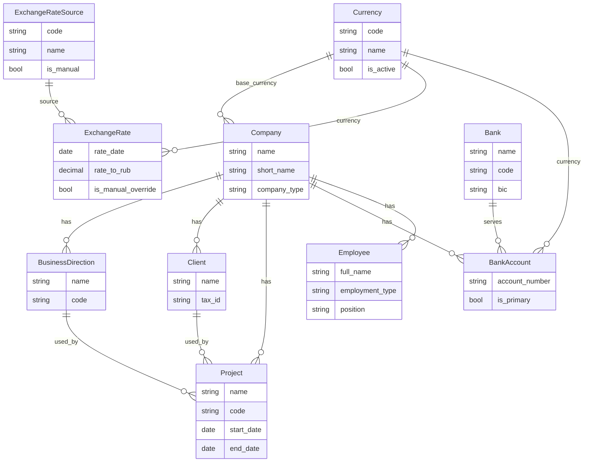
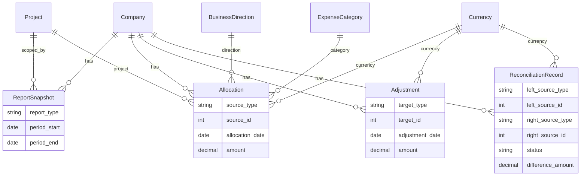

# Current Data Model of `group_finance`

## 1. Общий обзор проекта

### Apps проекта

В проекте сейчас присутствуют следующие Django apps:

- `core`
- `org`
- `people`
- `imports`
- `banking`
- `worklog`
- `payroll`
- `revenue`
- `expenses`
- `analytics`

### Какие apps содержат реальные модели

Все перечисленные apps сейчас содержат реальные модели.

### Какие apps пустые или почти пустые

Полностью пустых apps среди перечисленных нет.

Почти пустые по объёму доменной модели:

- `people` — 1 модель (`Employee`)
- `banking` — 1 модель (`BankTransaction`)
- `worklog` — 1 модель (`TimesheetEntry`)

### Как в целом устроен слой данных

Текущая структура слоя данных уже разделена на несколько логических уровней:

- `core` — инфраструктурный фундамент: mixin'ы, валюты, курсы, общие служебные сущности
- `org` — базовые справочники компании и организационной структуры
- `people` — сотрудники
- `imports` — слой логического импорта и сырых данных
- `banking`, `worklog`, `payroll`, `revenue`, `expenses` — слой нормализованных фактов и документов
- `analytics` — аналитический и контрольный слой поверх фактов

В проекте уже явно прослеживается паттерн многослойной модели данных:

1. Справочники и инфраструктура
2. Факты / документы
3. Аналитическая интерпретация и контроль

---

## 2. Каталог моделей

Ниже перечислены только фактически существующие модели в текущем коде.

### `core`

| App | Модель | Тип сущности | Назначение | Основные поля | Ключевые связи | Mixins | `clean()` | `code` | `CodeMixin` | `is_active` | `note` |
|---|---|---|---|---|---|---|---|---|---|---|---|
| `core` | `Currency` | инфраструктурная / справочник | Справочник валют | `code`, `name` | — | `TimeStampedModel`, `ActiveMixin` | нет | да | нет | да | нет |
| `core` | `ExchangeRateSource` | инфраструктурная / справочник | Источник курса валют | `code`, `name`, `is_manual` | — | `TimeStampedModel`, `NoteMixin` | нет | да | нет | нет | да |
| `core` | `ExchangeRate` | инфраструктурная / операционная | Курс валюты на дату по источнику | `rate_date`, `rate_to_rub`, `is_manual_override` | `currency -> Currency`, `source -> ExchangeRateSource` | `TimeStampedModel`, `NoteMixin` | да | нет | нет | нет | да |
| `core` | `Comment` | инфраструктурная | Универсальный комментарий | `content` | `created_by -> AUTH_USER_MODEL` | `TimeStampedModel`, `NoteMixin`, `ActiveMixin` | нет | нет | нет | да | да |
| `core` | `Attachment` | инфраструктурная | Универсальное вложение | `file`, `original_name`, `mime_type`, `size_bytes` | `uploaded_by -> AUTH_USER_MODEL` | `TimeStampedModel`, `NoteMixin`, `ActiveMixin` | нет | нет | нет | да | да |
| `core` | `AuditLog` | инфраструктурная | Журнал аудита действий по сущностям | `entity_type`, `entity_id`, `action`, `payload` | `actor -> AUTH_USER_MODEL` | `TimeStampedModel` | нет | нет | нет | нет | нет |

### `core` mixin'ы и utility-компоненты

| App | Объект | Роль | Комментарий |
|---|---|---|---|
| `core` | `TimeStampedModel` | mixin | Общие поля `created_at` / `updated_at` |
| `core` | `NoteMixin` | mixin | Добавляет `note` |
| `core` | `ActiveMixin` | mixin | Добавляет `is_active` |
| `core` | `CodeMixin` | mixin | Автогенерирует `code` через `generate_unique_code()` при пустом коде |
| `core` | `generate_unique_code()` | utility | Базовый генератор короткого бизнес-кода на основе `name` |

### `org`

| App | Модель | Тип сущности | Назначение | Основные поля | Ключевые связи | Mixins | `clean()` | `code` | `CodeMixin` | `is_active` | `note` |
|---|---|---|---|---|---|---|---|---|---|---|---|
| `org` | `Company` | справочник | Компания / базовая организационная единица | `name`, `short_name`, `company_type`, `tax_id`, `registration_country` | `base_currency -> core.Currency` | `TimeStampedModel`, `NoteMixin`, `ActiveMixin` | нет | нет | нет | да | да |
| `org` | `BusinessDirection` | справочник | Направление бизнеса внутри компании | `name`, `code` | `company -> Company` | `CodeMixin`, `TimeStampedModel`, `NoteMixin`, `ActiveMixin` | нет | да | да | да | да |
| `org` | `Client` | справочник | Клиент компании | `name`, `tax_id` | `company -> Company` | `TimeStampedModel`, `NoteMixin`, `ActiveMixin` | нет | нет | нет | да | да |
| `org` | `Project` | справочник / управленческая сущность | Проект компании | `name`, `code`, `start_date`, `end_date` | `company -> Company`, `business_direction -> BusinessDirection`, `client -> Client` | `CodeMixin`, `TimeStampedModel`, `NoteMixin`, `ActiveMixin` | да | да | да | да | да |
| `org` | `Bank` | справочник | Банк | `name`, `short_name`, `code`, `country`, `bic`, `address` | — | `CodeMixin`, `TimeStampedModel`, `NoteMixin`, `ActiveMixin` | нет | да | да | да | да |
| `org` | `BankAccount` | операционная / инфраструктурная привязка | Банковский счёт компании | `account_number`, `is_primary` | `company -> Company`, `bank -> Bank`, `currency -> core.Currency` | `TimeStampedModel`, `NoteMixin`, `ActiveMixin` | нет | нет | нет | да | да |

### `people`

| App | Модель | Тип сущности | Назначение | Основные поля | Ключевые связи | Mixins | `clean()` | `code` | `CodeMixin` | `is_active` | `note` |
|---|---|---|---|---|---|---|---|---|---|---|---|
| `people` | `Employee` | операционная / справочник персонала | Сотрудник компании | `full_name`, `email`, `employment_type`, `position`, `hire_date`, `fire_date` | `user -> AUTH_USER_MODEL`, `company -> Company` | `TimeStampedModel`, `NoteMixin`, `ActiveMixin` | да | нет | нет | да | да |

### `imports`

| App | Модель | Тип сущности | Назначение | Основные поля | Ключевые связи | Mixins | `clean()` | `code` | `CodeMixin` | `is_active` | `note` |
|---|---|---|---|---|---|---|---|---|---|---|---|
| `imports` | `ImportBatch` | инфраструктурная | Логический пакет импорта | `import_type`, `status`, `started_at`, `finished_at` | `company -> Company`, `created_by -> AUTH_USER_MODEL` | `TimeStampedModel`, `NoteMixin` | да | нет | нет | нет | да |
| `imports` | `ImportFile` | инфраструктурная | Файл внутри пакета импорта | `file`, `original_name`, `mime_type`, `size_bytes`, `status` | `batch -> ImportBatch`, `uploaded_by -> AUTH_USER_MODEL` | `TimeStampedModel`, `NoteMixin` | нет | нет | нет | нет | да |
| `imports` | `ImportRowRaw` | инфраструктурная | Сырая строка из импортируемого файла | `row_number`, `raw_payload`, `status` | `batch -> ImportBatch`, `import_file -> ImportFile` | `TimeStampedModel` | да | нет | нет | нет | нет |
| `imports` | `ImportError` | инфраструктурная / контрольная | Ошибка обработки импорта | `error_code`, `message`, `level` | `batch -> ImportBatch`, `import_file -> ImportFile`, `import_row -> ImportRowRaw` | `TimeStampedModel` | да | нет | нет | нет | нет |

### `banking`

| App | Модель | Тип сущности | Назначение | Основные поля | Ключевые связи | Mixins | `clean()` | `code` | `CodeMixin` | `is_active` | `note` |
|---|---|---|---|---|---|---|---|---|---|---|---|
| `banking` | `BankTransaction` | операционная | Нормализованный факт банковской операции | `transaction_date`, `amount`, `direction`, `description`, `external_id` | `company -> Company`, `bank_account -> BankAccount`, `currency -> core.Currency` | `TimeStampedModel`, `NoteMixin` | да | нет | нет | нет | да |

### `worklog`

| App | Модель | Тип сущности | Назначение | Основные поля | Ключевые связи | Mixins | `clean()` | `code` | `CodeMixin` | `is_active` | `note` |
|---|---|---|---|---|---|---|---|---|---|---|---|
| `worklog` | `TimesheetEntry` | операционная | Запись таймшита / фактическое рабочее время | `work_date`, `hours`, `description`, `is_billable` | `employee -> Employee`, `company -> Company`, `project -> Project` | `TimeStampedModel` | да | нет | нет | нет | нет |

### `payroll`

| App | Модель | Тип сущности | Назначение | Основные поля | Ключевые связи | Mixins | `clean()` | `code` | `CodeMixin` | `is_active` | `note` |
|---|---|---|---|---|---|---|---|---|---|---|---|
| `payroll` | `SalaryRate` | операционная | Ставка сотрудника на дату | `amount`, `effective_from` | `employee -> Employee`, `currency -> core.Currency` | `TimeStampedModel` | нет | нет | нет | нет | нет |
| `payroll` | `Payroll` | операционная | Начисление зарплаты за период | `period_start`, `period_end`, `amount`, `is_paid` | `employee -> Employee`, `currency -> core.Currency` | `TimeStampedModel` | да | нет | нет | нет | нет |
| `payroll` | `PayrollPayment` | операционная | Выплата зарплаты | `payment_date`, `amount`, `status` | `company -> Company`, `employee -> Employee`, `payroll -> Payroll`, `currency -> core.Currency` | `TimeStampedModel`, `NoteMixin` | да | нет | нет | нет | да |

### `revenue`

| App | Модель | Тип сущности | Назначение | Основные поля | Ключевые связи | Mixins | `clean()` | `code` | `CodeMixin` | `is_active` | `note` |
|---|---|---|---|---|---|---|---|---|---|---|---|
| `revenue` | `Revenue` | операционная | Факт признания выручки | `period_start`, `period_end`, `amount`, `recognized_date` | `company -> Company`, `client -> Client`, `project -> Project`, `currency -> core.Currency` | `TimeStampedModel`, `NoteMixin` | нет | нет | нет | нет | да |
| `revenue` | `Invoice` | документная | Счёт клиенту | `number`, `issue_date`, `due_date`, `status`, `total_amount` | `company -> Company`, `client -> Client`, `project -> Project`, `currency -> core.Currency` | `TimeStampedModel`, `NoteMixin` | да | нет | нет | нет | да |
| `revenue` | `InvoiceLine` | документная | Строка счёта | `line_number`, `description`, `quantity`, `unit_price` | `invoice -> Invoice` | `TimeStampedModel` | да | нет | нет | нет | нет |
| `revenue` | `Act` | документная | Акт выполненных работ / оказанных услуг | `number`, `act_date`, `status`, `total_amount` | `company -> Company`, `client -> Client`, `project -> Project`, `currency -> core.Currency` | `TimeStampedModel`, `NoteMixin` | да | нет | нет | нет | да |
| `revenue` | `ActLine` | документная | Строка акта | `line_number`, `description`, `quantity`, `unit_price` | `act -> Act` | `TimeStampedModel` | да | нет | нет | нет | нет |

### `expenses`

| App | Модель | Тип сущности | Назначение | Основные поля | Ключевые связи | Mixins | `clean()` | `code` | `CodeMixin` | `is_active` | `note` |
|---|---|---|---|---|---|---|---|---|---|---|---|
| `expenses` | `ExpenseCategory` | справочник | Категория расхода | `name`, `code` | — | `TimeStampedModel` | нет | да | нет | нет | нет |
| `expenses` | `Expense` | операционная | Факт расхода | `period_start`, `period_end`, `amount`, `recognized_date`, `is_operational` | `company -> Company`, `category -> ExpenseCategory`, `project -> Project`, `business_direction -> BusinessDirection`, `currency -> core.Currency` | `TimeStampedModel`, `NoteMixin` | да | нет | нет | нет | да |

### `analytics`

| App | Модель | Тип сущности | Назначение | Основные поля | Ключевые связи | Mixins | `clean()` | `code` | `CodeMixin` | `is_active` | `note` |
|---|---|---|---|---|---|---|---|---|---|---|---|
| `analytics` | `ReportSnapshot` | аналитическая / контрольная | Снимок управленческого отчёта | `report_type`, `period_start`, `period_end`, `data`, `generated_at` | `company -> Company`, `project -> Project` | `TimeStampedModel` | нет | нет | нет | нет | нет |
| `analytics` | `Allocation` | аналитическая / контрольная | Разнесение суммы факта на аналитики | `source_type`, `source_id`, `allocation_date`, `amount` | `company -> Company`, `currency -> core.Currency`, `project -> Project`, `business_direction -> BusinessDirection`, `expense_category -> ExpenseCategory` | `TimeStampedModel` | да | нет | нет | нет | нет |
| `analytics` | `Adjustment` | аналитическая / контрольная | Корректировка объекта без замены исходного факта | `target_type`, `target_id`, `adjustment_date`, `amount`, `reason` | `company -> Company`, `currency -> core.Currency` | `TimeStampedModel` | да | нет | нет | нет | нет |
| `analytics` | `ReconciliationRecord` | аналитическая / контрольная | Контрольная сверка двух источников | `left_source_type`, `left_source_id`, `right_source_type`, `right_source_id`, `status`, `difference_amount`, `checked_at` | `company -> Company`, `currency -> core.Currency` | `TimeStampedModel` | да | нет | нет | нет | нет |

---

## 3. Связи между моделями

### Центральные модели

Ядро текущей модели строится вокруг нескольких центральных сущностей:

- `Company` — главная организационная опора почти для всех предметных слоёв
- `Currency` — общий справочник валют для финансовых фактов
- `Project` — центральная управленческая аналитика
- `Employee` — центр кадрового, payroll- и worklog-слоя

### Ядро справочников

Основные справочники сейчас находятся в `core` и `org`:

- `Currency`
- `ExchangeRateSource`
- `Company`
- `BusinessDirection`
- `Client`
- `Bank`
- `ExpenseCategory`

Из них особенно важны:

- `Company` — на неё опираются почти все фактовые и аналитические сущности
- `Project` — связывает revenue, expenses, worklog и часть analytics
- `Currency` — связывает banking, payroll, revenue, expenses, analytics

### Слой фактов и документов

Фактовый слой сейчас распределён по нескольким apps:

- `banking.BankTransaction`
- `worklog.TimesheetEntry`
- `payroll.SalaryRate`, `Payroll`, `PayrollPayment`
- `revenue.Revenue`, `Invoice`, `InvoiceLine`, `Act`, `ActLine`
- `expenses.Expense`

Это уже даёт основу для финансовой и управленческой аналитики без дублирования справочников.

### Слой импорта

`imports` не содержит бизнес-фактов как таковых. Он хранит:

- логический пакет импорта
- файлы импорта
- сырые строки
- ошибки разбора/обработки

Это отдельный инфраструктурный слой, предназначенный для трассировки происхождения данных.

### Аналитический слой

`analytics` уже выступает отдельным слоем интерпретации:

- `ReportSnapshot` — зафиксированное состояние отчёта
- `Allocation` — управленческое разнесение суммы по аналитикам
- `Adjustment` — ручная корректировка объекта
- `ReconciliationRecord` — запись сверки между двумя источниками

Важно: аналитический слой не заменяет исходные факты. Он наслаивается поверх них.

### Главные направления ссылок

В упрощённом виде зависимости выглядят так:

- `core` -> фундамент для всех
- `org` -> базовые справочники для фактов
- `people` -> сотрудники для worklog/payroll
- `imports` -> самостоятельный слой импорта
- `banking` / `worklog` / `payroll` / `revenue` / `expenses` -> факты и документы
- `analytics` -> интерпретация и контроль поверх фактов

---

## 4. ERD / диаграмма связей

### 4.1 Core / Org

### 4.2 Imports / Facts

```mermaid
erDiagram
    ImportBatch {
        string import_type
        string status
    }
    ImportFile {
        string original_name
        string status
    }
    ImportRowRaw {
        int row_number
        string status
    }
    ImportError {
        string error_code
        string level
    }
    BankTransaction {
        date transaction_date
        decimal amount
        string direction
    }
    TimesheetEntry {
        date work_date
        decimal hours
        bool is_billable
    }
    SalaryRate {
        decimal amount
        date effective_from
    }
    Payroll {
        date period_start
        date period_end
        decimal amount
    }
    PayrollPayment {
        date payment_date
        decimal amount
        string status
    }
    Revenue {
        date period_start
        date period_end
        decimal amount
    }
    Invoice {
        string number
        date issue_date
        decimal total_amount
    }
    InvoiceLine {
        int line_number
        decimal quantity
        decimal unit_price
    }
    Act {
        string number
        date act_date
        decimal total_amount
    }
    ActLine {
        int line_number
        decimal quantity
        decimal unit_price
    }
    ExpenseCategory {
        string name
        string code
    }
    Expense {
        date period_start
        date period_end
        decimal amount
        bool is_operational
    }

    ImportBatch ||--o{ ImportFile : contains
    ImportBatch ||--o{ ImportRowRaw : groups
    ImportBatch ||--o{ ImportError : has
    ImportFile ||--o{ ImportRowRaw : contains
    ImportFile ||--o{ ImportError : has
    ImportRowRaw ||--o{ ImportError : has

    Company ||--o{ BankTransaction : has
    BankAccount ||--o{ BankTransaction : has
    Currency ||--o{ BankTransaction : currency

    Employee ||--o{ TimesheetEntry : logs
    Company ||--o{ TimesheetEntry : owns
    Project ||--o{ TimesheetEntry : related

    Employee ||--o{ SalaryRate : has
    Currency ||--o{ SalaryRate : currency
    Employee ||--o{ Payroll : has
    Currency ||--o{ Payroll : currency
    Employee ||--o{ PayrollPayment : has
    Payroll ||--o{ PayrollPayment : paid_by
    Currency ||--o{ PayrollPayment : currency

    Company ||--o{ Revenue : has
    Client ||--o{ Revenue : has
    Project ||--o{ Revenue : related
    Currency ||--o{ Revenue : currency

    Company ||--o{ Invoice : issues
    Client ||--o{ Invoice : billed_to
    Project ||--o{ Invoice : related
    Currency ||--o{ Invoice : currency
    Invoice ||--o{ InvoiceLine : contains

    Company ||--o{ Act : issues
    Client ||--o{ Act : billed_to
    Project ||--o{ Act : related
    Currency ||--o{ Act : currency
    Act ||--o{ ActLine : contains

    Company ||--o{ Expense : incurs
    ExpenseCategory ||--o{ Expense : classifies
    Project ||--o{ Expense : related
    BusinessDirection ||--o{ Expense : related
    Currency ||--o{ Expense : currency
```

### 4.3 Analytics

---

## 5. Архитектурные комментарии

### Что уже выглядит хорошо

1. **Слои уже разделены по смыслу**
   - инфраструктура (`core`)
   - справочники (`org`)
   - факты и документы (`banking`, `worklog`, `payroll`, `revenue`, `expenses`)
   - аналитика (`analytics`)

2. **Есть единый набор mixin'ов**
   - `TimeStampedModel`
   - `NoteMixin`
   - `ActiveMixin`
   - `CodeMixin`

3. **Code pattern уже сформирован**
   - `CodeMixin` используется не везде подряд, а только у моделей, где бизнес-код действительно нужен (`BusinessDirection`, `Project`, `Bank`)

4. **Валидации в основном локальные и безопасные**
   - даты периода
   - положительные суммы
   - согласованность компании у связанных сущностей

5. **Analytics отделён от fact layer**
   - это важное и правильное решение: аналитика не встраивается внутрь фактов

### Какие паттерны уже выработаны

- доменные связи строятся в основном через `ForeignKey`
- проект является ключевой управленческой аналитикой
- компания — главный организационный якорь системы
- валюта проведена через большинство финансовых слоёв как общий справочник
- import layer отделён от domain facts
- analytics layer использует упрощённые ссылки `type + id` вместо сложной инфраструктуры `GenericForeignKey`

### Где есть сознательные упрощения MVP

1. `analytics.Allocation`, `Adjustment`, `ReconciliationRecord`
- используют `type + id`, а не полноценные полиморфные связи

2. `InvoiceLine` и `ActLine`
- не содержат отдельного `line_amount`
- арифметика намеренно упрощена

3. `imports`
- хранит сырые строки и ошибки, но не реализует сложный orchestration layer

4. `Expense`
- уже покрывает смысл operating expense без отдельной новой модели `OperatingExpense`

5. `Payroll`
- фактически уже играет роль начисления зарплаты, без отдельного `PayrollAccrual`

### Где есть расхождения между идеальной схемой и текущей реализацией

1. В коде отсутствует часть ожидаемого "первого круга":
- `products`
- `project_products`
- `counterparties`
- `persons`
- `person_company_engagements`

2. `BankAccount` размещён в `org`, а не в `banking`
- это не ошибка, а текущее архитектурное решение

3. В revenue-слое сосуществуют:
- агрегированный факт `Revenue`
- документные модели `Invoice` / `Act`

Это допустимо, но в будущем потребует более явного описания семантики: как именно документы соотносятся с фактом признания выручки.

### Где есть потенциал для будущего расширения

- более богатый import-to-fact traceability layer
- отдельная продуктовая модель
- слой counterparties / persons
- более формализованный документный lifecycle
- более строгая reconciliation-логика
- более явные links между fact layer и analytics layer

### Где есть потенциальный технический долг

1. **Некоторые модели и файлы содержат признаки кодировочных артефактов**
- сами Python-структуры рабочие, но текстовые метки местами выглядят как mojibake в исходниках

2. **`CodeMixin` встроен через `save()` + `full_clean()`**
- это уже проектный контракт, но он достаточно сильный и влияет на все модели, которые его используют

3. **Часть смыслов пока выражена через упрощённые модели**
- например, `Expense` как единый факт расхода
- `Payroll` как единый факт начисления

Это нормально для MVP, но в будущем может потребовать более детальной предметной декомпозиции.

---

## 6. Реализовано vs не реализовано

### Уже реализовано

Фактически реализованы:

- компании
- направления бизнеса
- клиенты
- проекты
- банки
- банковские счета
- сотрудники
- валюты
- курсы валют
- import batches / files / raw rows / errors
- банковские операции
- записи таймшита
- ставки сотрудников
- начисления зарплаты
- выплаты зарплаты
- факты выручки
- счета и строки счетов
- акты и строки актов
- категории расходов
- расходы
- аналитические разнесения
- корректировки
- записи сверки
- report snapshots
- универсальные comments / attachments / audit log

### Ещё не реализовано в коде

На текущий момент в коде не найдены:

- `products`
- `project_products`
- `counterparties`
- `persons`
- `person_company_engagements`
- полноценные allocation rules
- автоматические алгоритмы reconciliation
- сложные adjustment / allocation workflows

### Сознательно отложено или упрощено

- `GenericForeignKey` в аналитическом слое
- сложные механизмы распределения
- полноценный double-entry учёт
- сложные контрольные контуры поверх фактов

### Где текущая модель уже покрывает смысл сущностью с другим именем

- смысл `operating_expenses` сейчас покрывает `expenses.Expense`
- смысл `payroll_accruals` сейчас покрывает `payroll.Payroll`
- слой аналитики реализован в `analytics`, а не в отдельном `allocations` / `finance` app