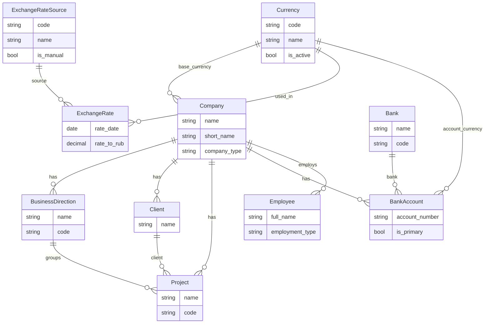
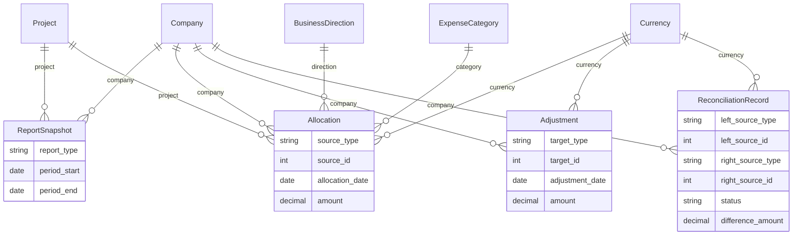

# Current Data Model Map of `group_finance`

## 1. Общий обзор проекта

### 1.1 Apps проекта

В коде проекта сейчас присутствуют следующие apps:

- `analytics`
- `banking`
- `core`
- `expenses`
- `imports`
- `org`
- `payroll`
- `people`
- `revenue`
- `worklog`

### 1.2 Какие apps содержат модели

Все перечисленные apps содержат реальные Django models.

### 1.3 Какие apps пустые или почти пустые

Полностью пустых apps среди перечисленных нет.

Почти пустые по объёму модели данных:

- `people` — 1 модель
- `banking` — 1 модель
- `worklog` — 1 модель

### 1.4 Как устроен слой данных

Фактическая структура данных уже разделена по слоям:

- `core` — инфраструктурный фундамент и общие mixin'ы
- `org` — организационные справочники
- `people` — кадровая сущность сотрудника
- `imports` — слой импорта и сырых данных
- `banking`, `worklog`, `payroll`, `revenue`, `expenses` — слой фактов и документов
- `analytics` — слой аналитики и контроля

### 1.5 Проверяемые факты по типам связей

По текущему коду:

- `ForeignKey` используется активно
- `OneToOneField` не найден
- `ManyToManyField` не найден

Это факт по текущему состоянию `models.py`.

---

## 2. Структурный каталог моделей

Ниже перечислены все фактически существующие модели. Классификация типа сущности — аналитическая интерпретация текущего состояния кода.

### 2.1 `core`

| App | Модель | Тип сущности | Статус | Назначение | Основные поля | Связи | Mixin'ы | `code` | `is_active` | `note` | `clean()` | Проверки `clean()` | Уникальные ограничения |
|---|---|---|---|---|---|---|---|---|---|---|---|---|---|
| `core` | `Currency` | инфраструктурная / справочник | расширяемая | Справочник валют проекта. Используется как базовая валюта компании и валюта финансовых фактов. | `code`, `name` | — | `TimeStampedModel`, `ActiveMixin` | да | да | нет | нет | — | `code` unique |
| `core` | `ExchangeRateSource` | инфраструктурная / справочник | расширяемая | Источник курса валют. Хранит наименование и признак ручного источника. | `code`, `name`, `is_manual` | — | `TimeStampedModel`, `NoteMixin` | да | нет | да | нет | — | `code` unique |
| `core` | `ExchangeRate` | инфраструктурная / операционная | расширяемая | Курс валюты на дату по конкретному источнику. | `rate_date`, `rate_to_rub`, `is_manual_override` | `currency -> Currency`, `source -> ExchangeRateSource` | `TimeStampedModel`, `NoteMixin` | нет | нет | да | да | `rate_to_rub > 0` | `UniqueConstraint(currency, rate_date, source)` |
| `core` | `Comment` | инфраструктурная | MVP | Универсальный комментарий с автором и активностью. | `content` | `created_by -> AUTH_USER_MODEL` | `TimeStampedModel`, `NoteMixin`, `ActiveMixin` | нет | да | да | нет | — | нет |
| `core` | `Attachment` | инфраструктурная | MVP | Универсальное вложение с метаданными файла. | `file`, `original_name`, `mime_type`, `size_bytes` | `uploaded_by -> AUTH_USER_MODEL` | `TimeStampedModel`, `NoteMixin`, `ActiveMixin` | нет | да | да | нет | — | нет |
| `core` | `AuditLog` | инфраструктурная | MVP | Журнал аудита с типом сущности, ID и действием. | `entity_type`, `entity_id`, `action`, `payload` | `actor -> AUTH_USER_MODEL` | `TimeStampedModel` | нет | нет | нет | нет | — | нет |

### 2.2 `org`

| App | Модель | Тип сущности | Статус | Назначение | Основные поля | Связи | Mixin'ы | `code` | `is_active` | `note` | `clean()` | Проверки `clean()` | Уникальные ограничения |
|---|---|---|---|---|---|---|---|---|---|---|---|---|---|
| `org` | `Company` | справочник | расширяемая | Базовая организационная сущность компании. | `name`, `short_name`, `company_type`, `tax_id`, `registration_country` | `base_currency -> core.Currency` | `TimeStampedModel`, `NoteMixin`, `ActiveMixin` | нет | да | да | нет | — | нет |
| `org` | `BusinessDirection` | справочник | расширяемая | Направление бизнеса внутри компании. | `name`, `code` | `company -> Company` | `CodeMixin`, `TimeStampedModel`, `NoteMixin`, `ActiveMixin` | да | да | да | нет | — | `code` unique; `UniqueConstraint(company, name)` |
| `org` | `Client` | справочник | расширяемая | Клиент компании-владельца. | `name`, `tax_id` | `company -> Company` | `TimeStampedModel`, `NoteMixin`, `ActiveMixin` | нет | да | да | нет | — | `UniqueConstraint(company, name)` |
| `org` | `Project` | справочник / управленческая сущность | спорная | Проект компании с привязкой к клиенту и направлению бизнеса. | `name`, `code`, `start_date`, `end_date` | `company -> Company`, `business_direction -> BusinessDirection`, `client -> Client` | `CodeMixin`, `TimeStampedModel`, `NoteMixin`, `ActiveMixin` | да | да | да | да | `company ↔ direction` | `code` unique |
| `org` | `Bank` | справочник | расширяемая | Справочник банков. | `name`, `short_name`, `code`, `country`, `bic`, `address` | — | `CodeMixin`, `TimeStampedModel`, `NoteMixin`, `ActiveMixin` | да | да | да | нет | — | `code` unique |
| `org` | `BankAccount` | операционная / инфраструктурная привязка | расширяемая | Банковский счёт компании. | `account_number`, `is_primary` | `company -> Company`, `bank -> Bank`, `currency -> core.Currency` | `TimeStampedModel`, `NoteMixin`, `ActiveMixin` | нет | да | да | нет | — | `UniqueConstraint(company, account_number)` |

### 2.3 `people`

| App | Модель | Тип сущности | Статус | Назначение | Основные поля | Связи | Mixin'ы | `code` | `is_active` | `note` | `clean()` | Проверки `clean()` | Уникальные ограничения |
|---|---|---|---|---|---|---|---|---|---|---|---|---|---|
| `people` | `Employee` | операционная | спорная | Сотрудник компании с типом занятости и кадровыми датами. | `full_name`, `email`, `employment_type`, `position`, `hire_date`, `fire_date` | `user -> AUTH_USER_MODEL`, `company -> Company` | `TimeStampedModel`, `NoteMixin`, `ActiveMixin` | нет | да | да | да | `проверка периода дат` | нет |

### 2.4 `imports`

| App | Модель | Тип сущности | Статус | Назначение | Основные поля | Связи | Mixin'ы | `code` | `is_active` | `note` | `clean()` | Проверки `clean()` | Уникальные ограничения |
|---|---|---|---|---|---|---|---|---|---|---|---|---|---|
| `imports` | `ImportBatch` | инфраструктурная | MVP | Логический пакет импорта с типом и статусом обработки. | `import_type`, `status`, `started_at`, `finished_at` | `company -> Company`, `created_by -> AUTH_USER_MODEL` | `TimeStampedModel`, `NoteMixin` | нет | нет | да | да | `finished_at >= started_at` | нет |
| `imports` | `ImportFile` | инфраструктурная | MVP | Файл внутри пакета импорта. | `file`, `original_name`, `mime_type`, `size_bytes`, `status` | `batch -> ImportBatch`, `uploaded_by -> AUTH_USER_MODEL` | `TimeStampedModel`, `NoteMixin` | нет | нет | да | нет | — | нет |
| `imports` | `ImportRowRaw` | инфраструктурная | MVP | Сырая строка файла импорта. | `row_number`, `raw_payload`, `status` | `batch -> ImportBatch`, `import_file -> ImportFile` | `TimeStampedModel` | нет | нет | нет | да | `file ↔ batch` | `UniqueConstraint(import_file, row_number)` |
| `imports` | `ImportError` | инфраструктурная / контрольная | MVP | Ошибка импорта, привязанная к пакету, файлу или строке. | `error_code`, `message`, `level` | `batch -> ImportBatch`, `import_file -> ImportFile`, `import_row -> ImportRowRaw` | `TimeStampedModel` | нет | нет | нет | да | `row/file ↔ batch` | нет |

### 2.5 `banking`

| App | Модель | Тип сущности | Статус | Назначение | Основные поля | Связи | Mixin'ы | `code` | `is_active` | `note` | `clean()` | Проверки `clean()` | Уникальные ограничения |
|---|---|---|---|---|---|---|---|---|---|---|---|---|---|
| `banking` | `BankTransaction` | операционная | MVP | Нормализованный факт банковской операции. | `transaction_date`, `amount`, `direction`, `description`, `external_id` | `company -> Company`, `bank_account -> BankAccount`, `currency -> core.Currency` | `TimeStampedModel`, `NoteMixin` | нет | нет | да | да | `amount > 0; company` | нет |

### 2.6 `worklog`

| App | Модель | Тип сущности | Статус | Назначение | Основные поля | Связи | Mixin'ы | `code` | `is_active` | `note` | `clean()` | Проверки `clean()` | Уникальные ограничения |
|---|---|---|---|---|---|---|---|---|---|---|---|---|---|
| `worklog` | `TimesheetEntry` | операционная | MVP | Факт учёта рабочего времени сотрудника по проекту. | `work_date`, `hours`, `description`, `is_billable` | `employee -> Employee`, `company -> Company`, `project -> Project` | `TimeStampedModel` | нет | нет | нет | да | `hours > 0; company` | нет |

### 2.7 `payroll`

| App | Модель | Тип сущности | Статус | Назначение | Основные поля | Связи | Mixin'ы | `code` | `is_active` | `note` | `clean()` | Проверки `clean()` | Уникальные ограничения |
|---|---|---|---|---|---|---|---|---|---|---|---|---|---|
| `payroll` | `SalaryRate` | операционная | MVP | Ставка сотрудника, действующая с определённой даты. | `amount`, `effective_from` | `employee -> Employee`, `currency -> core.Currency` | `TimeStampedModel` | нет | нет | нет | нет | — | нет |
| `payroll` | `Payroll` | операционная | MVP | Начисление зарплаты за период. | `period_start`, `period_end`, `amount`, `is_paid` | `employee -> Employee`, `currency -> core.Currency` | `TimeStampedModel` | нет | нет | нет | да | `period_end >= period_start` | нет |
| `payroll` | `PayrollPayment` | операционная | MVP | Выплата зарплаты, возможно связанная с начислением. | `payment_date`, `amount`, `status` | `company -> Company`, `employee -> Employee`, `payroll -> Payroll`, `currency -> core.Currency` | `TimeStampedModel`, `NoteMixin` | нет | нет | да | да | `amount > 0; company` | нет |

### 2.8 `revenue`

| App | Модель | Тип сущности | Статус | Назначение | Основные поля | Связи | Mixin'ы | `code` | `is_active` | `note` | `clean()` | Проверки `clean()` | Уникальные ограничения |
|---|---|---|---|---|---|---|---|---|---|---|---|---|---|
| `revenue` | `Revenue` | операционная | спорная | Факт признания выручки. | `period_start`, `period_end`, `amount`, `recognized_date` | `company -> Company`, `client -> Client`, `project -> Project`, `currency -> core.Currency` | `TimeStampedModel`, `NoteMixin` | нет | нет | да | нет | — | нет |
| `revenue` | `Invoice` | документная | расширяемая | Документ счёта клиенту. | `number`, `issue_date`, `due_date`, `status`, `total_amount` | `company -> Company`, `client -> Client`, `project -> Project`, `currency -> core.Currency` | `TimeStampedModel`, `NoteMixin` | нет | нет | да | да | `даты; amount > 0` | нет |
| `revenue` | `InvoiceLine` | документная | MVP | Строка счёта. | `line_number`, `description`, `quantity`, `unit_price` | `invoice -> Invoice` | `TimeStampedModel` | нет | нет | нет | да | `quantity/unit_price > 0` | нет |
| `revenue` | `Act` | документная | расширяемая | Документ акта. | `number`, `act_date`, `status`, `total_amount` | `company -> Company`, `client -> Client`, `project -> Project`, `currency -> core.Currency` | `TimeStampedModel`, `NoteMixin` | нет | нет | да | да | `project; amount > 0` | нет |
| `revenue` | `ActLine` | документная | MVP | Строка акта. | `line_number`, `description`, `quantity`, `unit_price` | `act -> Act` | `TimeStampedModel` | нет | нет | нет | да | `quantity/unit_price > 0` | нет |

### 2.9 `expenses`

| App | Модель | Тип сущности | Статус | Назначение | Основные поля | Связи | Mixin'ы | `code` | `is_active` | `note` | `clean()` | Проверки `clean()` | Уникальные ограничения |
|---|---|---|---|---|---|---|---|---|---|---|---|---|---|
| `expenses` | `ExpenseCategory` | справочник | MVP | Категория расхода. | `name`, `code` | — | `TimeStampedModel` | да | нет | нет | нет | — | `code` unique |
| `expenses` | `Expense` | операционная | MVP | Факт расхода компании по категории и периоду. | `period_start`, `period_end`, `amount`, `recognized_date`, `is_operational` | `company -> Company`, `category -> ExpenseCategory`, `project -> Project`, `business_direction -> BusinessDirection`, `currency -> core.Currency` | `TimeStampedModel`, `NoteMixin` | нет | нет | да | да | `период; project/company` | нет |

### 2.10 `analytics`

| App | Модель | Тип сущности | Статус | Назначение | Основные поля | Связи | Mixin'ы | `code` | `is_active` | `note` | `clean()` | Проверки `clean()` | Уникальные ограничения |
|---|---|---|---|---|---|---|---|---|---|---|---|---|---|
| `analytics` | `ReportSnapshot` | аналитическая / контрольная | спорная | Снимок отчёта за период в JSON-форме. | `report_type`, `period_start`, `period_end`, `data`, `generated_at` | `company -> Company`, `project -> Project` | `TimeStampedModel` | нет | нет | нет | нет | — | нет |
| `analytics` | `Allocation` | аналитическая / контрольная | MVP | Разнесение суммы аналитического источника на проект, направление или категорию. | `source_type`, `source_id`, `allocation_date`, `amount` | `company -> Company`, `currency -> core.Currency`, `project -> Project`, `business_direction -> BusinessDirection`, `expense_category -> ExpenseCategory` | `TimeStampedModel` | нет | нет | нет | да | `amount > 0; company` | нет |
| `analytics` | `Adjustment` | аналитическая / контрольная | MVP | Корректировка суммы по целевому объекту аналитики. | `target_type`, `target_id`, `adjustment_date`, `amount`, `reason` | `company -> Company`, `currency -> core.Currency` | `TimeStampedModel` | нет | нет | нет | да | `amount != 0; reason` | нет |
| `analytics` | `ReconciliationRecord` | аналитическая / контрольная | MVP | Запись сверки между двумя источниками с разницей и статусом. | `left_source_type`, `left_source_id`, `right_source_type`, `right_source_id`, `status`, `difference_amount`, `checked_at` | `company -> Company`, `currency -> core.Currency` | `TimeStampedModel` | нет | нет | нет | да | `difference >= 0; same-source` | нет |

---

## 3. Карта связей

### 3.1 Центральные сущности системы

Центр текущей модели данных составляют:

- `org.Company`
- `core.Currency`
- `org.Project`
- `people.Employee`

Почему это центральные сущности:

- `Company` связывает почти все предметные слои
- `Currency` используется в большинстве финансовых фактов, документов и аналитики
- `Project` выступает общей управленческой аналитикой для revenue, expenses, worklog и части analytics
- `Employee` соединяет кадровый, payroll- и worklog-слои

### 3.2 Справочники

К reference-моделям фактически относятся:

- `core.Currency`
- `core.ExchangeRateSource`
- `org.Company`
- `org.BusinessDirection`
- `org.Client`
- `org.Bank`
- `expenses.ExpenseCategory`

Частично справочными по роли также являются:

- `org.Project`
- `people.Employee`

Это не просто справочники в узком смысле, но они используются как опорные сущности в других слоях.

### 3.3 Факты

К моделям, отражающим события, операции или состояния, относятся:

- `banking.BankTransaction`
- `worklog.TimesheetEntry`
- `payroll.SalaryRate`
- `payroll.Payroll`
- `payroll.PayrollPayment`
- `revenue.Revenue`
- `expenses.Expense`

Это основной слой фактов системы.

### 3.4 Документные сущности

Документный слой сейчас сосредоточен в `revenue`:

- `Invoice`
- `InvoiceLine`
- `Act`
- `ActLine`

Сейчас документы есть именно в revenue-слое, а не во всех финансовых направлениях.

### 3.5 Аналитика и контроль

Аналитический слой находится в `analytics`:

- `ReportSnapshot`
- `Allocation`
- `Adjustment`
- `ReconciliationRecord`

Это не слой фактов. Он интерпретирует, распределяет, корректирует и сверяет уже существующие данные.

### 3.6 Поток слоёв: import → fact → analytics

Фактический поток данных по текущей модели можно описать так:

1. `imports`
   - пакет импорта
   - файл
   - сырая строка
   - ошибка импорта

2. fact/document layer
   - банковские операции
   - таймшиты
   - начисления и выплаты зарплаты
   - выручка, счета, акты
   - расходы

3. `analytics`
   - разнесение (`Allocation`)
   - корректировка (`Adjustment`)
   - сверка (`ReconciliationRecord`)
   - снимки отчётов (`ReportSnapshot`)

Предположение:
- import layer задуман как источник данных для fact layer, но в текущих моделях прямые связи import -> fact почти не проведены. Это наблюдение по коду, а не утверждение о бизнес-процессе.

## 3A. Ключевые паттерны проекта

- Базовые mixin'ы используются из `core`: `TimeStampedModel` для временных полей, `NoteMixin` для свободного комментария, `ActiveMixin` для мягкого признака активности.
- `CodeMixin` применяется точечно, в основном в справочниках и управленческих reference-моделях, где нужен короткий бизнес-код: `BusinessDirection`, `Project`, `Bank`.
- `clean()` используется локально и безопасно: валидации в основном проверяют период, положительность суммы и согласованность связанных сущностей по `company`.
- Справочники сосредоточены в `core`, `org` и частично в `expenses`; факт-слой вынесен в `banking`, `worklog`, `payroll`, `revenue`, `expenses`; аналитика и контроль живут отдельно в `analytics`.
- Инфраструктурные модели не смешиваются с бизнес-фактами: import-storage находится в `imports`, общие служебные сущности — в `core`.

## 3B. MVP-упрощения по моделям

- В `analytics` используются пары `type + id` через `TextChoices`, а не полиморфные связи или `GenericForeignKey`.
- В `InvoiceLine` и `ActLine` нет отдельного поля `line_amount`; хранится только минимальный набор для строки документа.
- В аналитическом слое отсутствуют allocation rules и автоматические алгоритмы разнесения.
- Документы `Invoice` и `Act` не имеют отдельного workflow-слоя согласования и проведения.
- Payroll-слой упрощён: начисление покрывается моделью `Payroll`, а выплаты вынесены в `PayrollPayment` без отдельной модели accrual-типа.
- Expense-слой упрощён: смысл operating expense закрывается единой моделью `Expense`.
- Import-layer реализован как storage-слой без сложной оркестрации pipeline.

---

## 4. ERD (Mermaid)

### A. `core` + `org`

### B. `imports` + facts/documents

```mermaid
erDiagram
    ImportBatch {
        string import_type
        string status
    }
    ImportFile {
        string original_name
        string status
    }
    ImportRowRaw {
        int row_number
        string status
    }
    ImportError {
        string error_code
        string level
    }
    BankTransaction {
        date transaction_date
        decimal amount
        string direction
    }
    TimesheetEntry {
        date work_date
        decimal hours
    }
    SalaryRate {
        decimal amount
        date effective_from
    }
    Payroll {
        date period_start
        date period_end
        decimal amount
    }
    PayrollPayment {
        date payment_date
        decimal amount
        string status
    }
    Revenue {
        date period_start
        date period_end
        decimal amount
    }
    Invoice {
        string number
        date issue_date
        decimal total_amount
    }
    InvoiceLine {
        int line_number
        decimal quantity
        decimal unit_price
    }
    Act {
        string number
        date act_date
        decimal total_amount
    }
    ActLine {
        int line_number
        decimal quantity
        decimal unit_price
    }
    ExpenseCategory {
        string name
        string code
    }
    Expense {
        date period_start
        date period_end
        decimal amount
    }

    ImportBatch ||--o{ ImportFile : contains
    ImportBatch ||--o{ ImportRowRaw : groups
    ImportBatch ||--o{ ImportError : has
    ImportFile ||--o{ ImportRowRaw : contains
    ImportFile ||--o{ ImportError : has
    ImportRowRaw ||--o{ ImportError : has

    Company ||--o{ BankTransaction : has
    BankAccount ||--o{ BankTransaction : account
    Currency ||--o{ BankTransaction : currency

    Employee ||--o{ TimesheetEntry : logs
    Company ||--o{ TimesheetEntry : company
    Project ||--o{ TimesheetEntry : project

    Employee ||--o{ SalaryRate : rate
    Currency ||--o{ SalaryRate : currency
    Employee ||--o{ Payroll : accrual
    Currency ||--o{ Payroll : currency
    Employee ||--o{ PayrollPayment : payment
    Payroll ||--o{ PayrollPayment : related
    Currency ||--o{ PayrollPayment : currency
    Company ||--o{ PayrollPayment : company

    Company ||--o{ Revenue : company
    Client ||--o{ Revenue : client
    Project ||--o{ Revenue : project
    Currency ||--o{ Revenue : currency

    Company ||--o{ Invoice : company
    Client ||--o{ Invoice : client
    Project ||--o{ Invoice : project
    Currency ||--o{ Invoice : currency
    Invoice ||--o{ InvoiceLine : lines

    Company ||--o{ Act : company
    Client ||--o{ Act : client
    Project ||--o{ Act : project
    Currency ||--o{ Act : currency
    Act ||--o{ ActLine : lines

    Company ||--o{ Expense : company
    ExpenseCategory ||--o{ Expense : category
    Project ||--o{ Expense : project
    BusinessDirection ||--o{ Expense : direction
    Currency ||--o{ Expense : currency
```

### C. `analytics`

---

## 5. Архитектурный анализ

### 5.1 Что реализовано хорошо

- Данные уже разделены по слоям: `core` / `org` / facts / `analytics`.
- В проекте есть устойчивый набор базовых mixin'ов.
- `CodeMixin` используется ограниченно, а не во всех моделях подряд.
- Во многих моделях есть локальные и безопасные `clean()`-валидации.
- Аналитический слой отделён от fact-слоя и не встроен внутрь fact-моделей.
- Import layer выделен в отдельный app, а не смешан с бизнес-фактами.

### 5.2 Упрощения MVP

- В `analytics` используются пары `type + id`, а не полноценные полиморфные связи.
- В `InvoiceLine` и `ActLine` нет отдельного поля `line_amount`.
- `Expense` покрывает смысл операционного расхода как единая модель.
- `Payroll` покрывает смысл начисления зарплаты как единая модель.
- В `imports` реализован базовый storage-layer импорта, без сложной оркестрации.

### 5.3 Неоднозначности

- `Project` формально похож на справочник, но по смыслу является также управленческой сущностью. Это неоднозначность классификации, а не ошибка.
- `Employee` сочетает признаки справочника персонала и операционной сущности. Это тоже неоднозначность уровня классификации.
- `Revenue` сосуществует рядом с документами `Invoice` и `Act`; по коду их семантическая связь не формализована. Это фактическая неоднозначность текущей модели.
- `ReportSnapshot` можно трактовать как аналитическую или контрольную сущность; в документе он помечен как аналитическая / контрольная.

### 5.4 Потенциальный технический долг

- В ряде файлов видны кодировочные артефакты в строковых метках. Это видно в исходниках и в консольном выводе.
- `CodeMixin` встроен через `save()` и вызывает `full_clean()`. Это сильный общий контракт для моделей, которые его используют.
- Часть предметной области уже выражена упрощёнными моделями, которые, возможно, будут детализироваться позже. Сейчас это только фиксация состояния, не рекомендация к срочному изменению.

---

## 6. Реализовано / не реализовано

### 6.1 Уже реализовано

По фактическому коду реализованы:

- компании
- направления бизнеса
- клиенты
- проекты
- банки
- банковские счета
- сотрудники
- валюты
- источники курсов
- курсы валют
- import batches / files / raw rows / errors
- банковские операции
- записи таймшита
- ставки сотрудников
- начисления зарплаты
- выплаты зарплаты
- факты выручки
- счета и строки счетов
- акты и строки актов
- категории расходов
- расходы
- снимки отчётов
- разнесения
- корректировки
- записи сверки
- comments / attachments / audit log

### 6.2 Первый круг

- `Company`, `BusinessDirection`, `Client`, `Project`, `Bank`, `BankAccount`, `Currency`, `ExchangeRate`, `ExchangeRateSource` — реализовано. Базовый reference-слой уже присутствует в коде.
- `products` — не реализовано. Отдельной product-модели в текущих `models.py` нет.
- `project_products` — не реализовано. Связки проекта с продуктами в коде нет.
- `counterparties` — не реализовано. Отдельной модели контрагента нет.
- `persons` — не реализовано. Универсальной person-модели нет.
- `person_company_engagements` — не реализовано. Отдельной модели участия персоны в компании нет.

### 6.3 Второй круг

- `ImportBatch`, `ImportFile`, `ImportRowRaw`, `ImportError` — реализовано. Слой импорта уже выделен в отдельный app `imports`.
- Прямые связи `import -> fact` — отложено. В текущем коде import-storage почти не связан напрямую с fact-моделями.

### 6.4 Третий круг

- `BankTransaction` — реализовано. Факт банковской операции вынесен в `banking`.
- `TimesheetEntry` — реализовано. Факт учёта рабочего времени вынесен в `worklog`.
- `payroll_accruals` — частично покрыто. Смысл начисления закрывается моделью `payroll.Payroll`.
- `PayrollPayment` — реализовано. Выплаты вынесены в отдельную модель `payroll.PayrollPayment`.
- `Invoice`, `InvoiceLine`, `Act`, `ActLine` — реализовано. Документный revenue-слой присутствует.
- `operating_expenses` — частично покрыто. Смысл операционного расхода закрывается моделью `expenses.Expense`.
- `Revenue` — реализовано. Отдельный факт признания выручки уже есть рядом с документами.

### 6.5 Четвёртый круг

- `Allocation` — реализовано. Разнесение вынесено в `analytics`.
- `Adjustment` — реализовано. Корректировки вынесены в `analytics`.
- `ReconciliationRecord` — реализовано. Контрольный слой сверки уже есть.
- allocation rules — отложено. Отдельных правил разнесения в коде нет.
- автоматические reconciliation-алгоритмы — отложено. Сверка хранится как запись результата, а не как механизм обработки.
- сложный workflow аналитики и контроля — отложено. В текущем коде нет отдельного process-layer для этих сущностей.

### 6.6 Какие сущности заменены другими моделями по смыслу

Это не факт схемы, а интерпретационный комментарий по текущему состоянию:

- смысл `operating_expenses` покрывается моделью `expenses.Expense`
- смысл `payroll_accruals` покрывается моделью `payroll.Payroll`

### 6.7 Какие сущности выглядят сознательно отложенными

Предположение по текущему состоянию проекта:

- product-layer
- counterparty/person-layer
- более сложные allocation/reconciliation механизмы

Это предположение основано на отсутствии соответствующих моделей в коде и наличии уже реализованных MVP-слоёв.

## 6A. Карта развития модели

- Reference-слой уже достаточно стабилен для наращивания недостающих сущностей первого круга, если они понадобятся предметной области.
- Import-layer готов к развитию в сторону связей с fact-моделями, если проекту потребуется более прозрачная трассировка происхождения данных.
- Fact-layer уже покрывает основные денежные и операционные потоки; логичное направление роста — детализация существующих моделей, а не обязательное создание новых параллельных сущностей.
- Document-layer в `revenue` уже готов к расширению через дополнительные статусы, связи и вычисления, если они действительно понадобятся.
- Analytics-слой готов к развитию в сторону правил распределения и более сложного контроля, но сейчас остаётся намеренно минимальным.